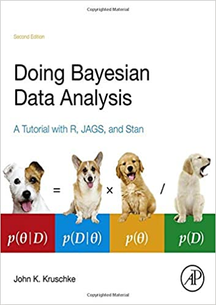
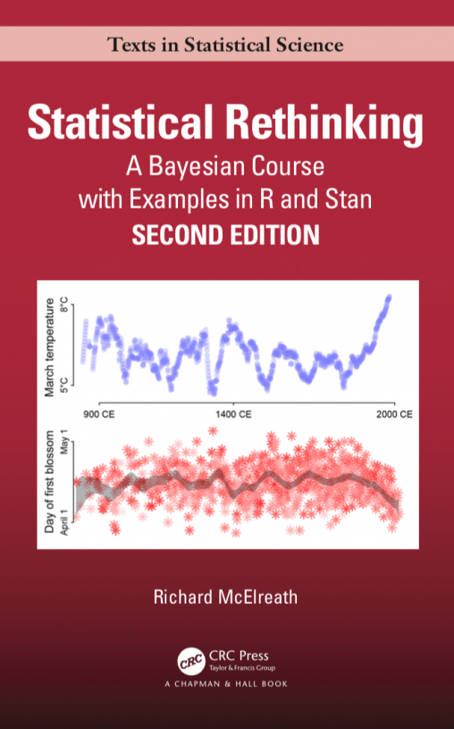

```{r setup, include=FALSE}
# Presentazione preparata da Michele Scandola per il webinar
# della Società Italiana di PsicoFisiologia e neuroscienze cognitive (SIPF)
# del 30 aprile 2021
# 
# Licenza afl-3.0

library(fontawesome)
library(knitr)
library(DT)
library(HDInterval)
library(bayesplot)
knitr::opts_chunk$set(echo = FALSE)
```

## Table of topics

> 1. Cosa è la statistica Bayesiana? <br>
> 2. Bayesian Parameter Estimation <br>
> 3. Bayesian Model Selection <br>
> 4. Bayesian Model Prediction <br>
> 5. Indici di affidabilità della statistica Bayesiana <br>
> 6. Ultimi concetti utili


## 1. Cosa è la statistica Bayesiana?


<table>
<tr>
<td style="vertical-align:top">

</td>
<td>
- Le origini: Bayes & Laplace
- $P(\theta|D) \propto P(D|\theta) \times P(\theta)$
- Distribuzione a priori $P(\theta)$ o $P(H)$:

  <blockquote>
    distribuzione di probabilità dell'ipotesi o dei parametri
    in forma di distribuzione dei dati. <br>
    _Come credo saranno distribuiti i dati._
  </blockquote>
  
- Funzione di verosomiglianza (likelihood) $P(D|\theta)$ o $P(D|H)$:
  
  <blockquote>
    distribuzione di probabilità dei dati tramite modello. <br>
    _Come sono realmente distribuiti i dati secondo la distribuzione scelta._
  </blockquote>
  
- Distribuzione a posteriori $P(\theta|D)$ o $P(H|D)$:

  <blockquote>
    distribuzione di probabilità dell'ipotesi o dei parametri dopo
    l'osservazione dei dati. <br>
    _Compromesso fra la mia aspettativa e i dati osservati._
  </blockquote>
  
</td>
</tr>
</table>
   
## Perché usarla?


- Affidabilità [@Etz2016; @Gelman2006]

- Accuratezza (con piccoli campioni e dati rumorosi)
  [@Kruschke2012; @Scandola2021]

- La possibilità di introdurre conoscenza precedente nelle analisi
  [@Kruschke2012; @Andrews2013]

- La probabilità nel contesto Bayesiano ha una interpretazione diretta
  [@Kruschke2010; @Wagenmakers2018]

- Possibilità di testare l'ipotesi nulla ($H_0$)

  
## Procedimento tipico

<div class="box" style="margin-left:5%;font-size:80%;">
- **Cosa mi aspetto?**

- Distribuzione a-priori.
- Una differenza di una certa dimensione (effect size).
- Nessuna ipotesi, priore non-informative o slightly informative.
  
* *Grafico della distribuzione a priori!*
</div>

<div class="box" style="margin-left:37%;margin-top:5%;font-size:80%;">
- **Cosa osservo?**

- Funzione di verosomiglianza.
- I dati modificano i parametri del modello matematico scelto
  (i $\beta$ di un modello lineare)
</div>

<div class="box" style="margin-left:70%;margin-top:10%;font-size:80%;">
- **Come cambia la mia aspettativa sui risultati, in seguito alle osservazioni?**

- Distribuzione a posteriori.
- Vedo se la differenza che mi attendevo è differente da quello
  che mi aspettavo. Il risultato è una sorta di "media pesata" fra la
  distribuzione a priori e la funzione di verosomiglianza.
</div>

## Un esempio 1/5 - modificato da [@Albert2009]

- Eseguiamo su un singolo partecipante un test composto
  da 30 prove diverse.

- Le prove sono abbastanza difficili.
  Ci aspettiamo un andamento 50/50.
  Questo è un priore informato!
  
- Con un approccio più prudenziale, proviamo anche un priore meno informato...

```{r, fig.height=3}
curve(dbeta(x,15+1,15+1),add=FALSE,
        lty=3,lwd=4, col = "green",
        xlab="percentuale di successo",
        ylab="Density", axes = FALSE)
curve(dbeta(x,2,2),
        lty=3,lwd=4, col = "orange",
        add = TRUE)
abline(v = 15/30, col = "grey")
axis(side = 1, at = seq(from = 0, to = 1, by = 0.1),
       labels = paste0(seq(from = 0, to = 100, by = 10), "%"))
legend("topright",
       col = c("green", "orange"),
       lty=c(3,3),lwd=c(4,4),
       legend = c("Priore informato", "Priore non informato"))
```

- Distribuzione a-priori informato $P(\theta) \sim \mathcal{B}(15+1,15+1)$
- Distribuzione a-priori non informato $P(\theta) \sim \mathcal{B}(2,2)$

## Un esempio 2/5 - modificato da [@Albert2009]

- Per ogni prova eseguita
  abbiamo il dato di accuratezza (1 = successo, 0 = fallimento).

- Il nostro partecipante riesce in 10 prove, ma ne sbaglia 20.

```{r, fig.height=3}
successes <- 10##33%
failures  <- 20##77%
curve(dbeta(x,successes+1,failures+1),add=FALSE,lty=2,lwd=4,
        col = "blue",
        xlab="percentuale di successo",
        ylab="Density", axes = FALSE)
abline(v = 10/30, col = "red")
abline(v = 15/30, col = "grey")
axis(side = 1, at = seq(from = 0, to = 1, by = 0.1),
       labels = paste0(seq(from = 0, to = 100, by = 10), "%"))
```

- Funzione di verosomiglianza $P(D|\theta) \sim \mathcal{B}(10+1,20+1)$

## Un esempio 3/5 - modificato da [@Albert2009]

- Combinando la nostra aspettativa con i dati,
  la nostra aspettativa cambia...

```{r, fig.height=3}
successes <- 10##33%
failures  <- 20##77%

par(mfrow=c(1,2))

curve(dbeta(x,15+successes,15+failures), from=0, to=1,
        xlab="percentuale di successo",
        ylab="Density",lty=1,lwd=4, ylim = c(0,10),
        axes = FALSE, col = "red",
      main = "Priore informato")
abline(v = 10/30, col = "red")
abline(v = 15/30, col = "grey")
axis(side = 1, at = seq(from = 0, to = 1, by = 0.1),
       labels = paste0(seq(from = 0, to = 100, by = 10), "%"))

curve(dbeta(x,2+successes,2+failures), from=0, to=1,
        xlab="percentuale di successo",
        ylab="Density",lty=1,lwd=4, ylim = c(0,10),
        axes = FALSE, col = "purple",
      main = "Priore non informato")
abline(v = 10/30, col = "red")
abline(v = 15/30, col = "grey")
axis(side = 1, at = seq(from = 0, to = 1, by = 0.1),
       labels = paste0(seq(from = 0, to = 100, by = 10), "%"))
```

- Distribuzione a posteriori con priore informato
  $P(\theta|D) \sim \mathcal{B}(15+10,15+20)$
  
- Distribuzione a posteriori con priore non informato
  $P(\theta|D) \sim \mathcal{B}(2+10,2+20)$

## Un esempio 4/5 - modificato da [@Albert2009]

Modifica il priore informato, lasciando i dati invariati.

```{r, fig.height=1}
renderPlot({
  a0 <- as.numeric(input$a)
  b0 <- 30 - a0
  
  successes <- 10##33%
  failures  <- 20##77%
  
  ## posterior
  curve(dbeta(x,a0+successes,b0+failures), from=0, to=1,
        xlab="percentuale di successo",
        ylab="Density",lty=1,lwd=4, ylim = c(0,10),
        axes = FALSE, col = "red", xlim = c(0,1))
  ## likelihood
  curve(dbeta(x,successes+1,failures+1),add=TRUE,lty=2,lwd=4,
        col = "blue")
  ## prior
  curve(dbeta(x,a0,b0),add=TRUE,lty=3,lwd=4, col = "green")
  legend(.7,10,c("Prior","Likelihood","Posterior"),
         lty=c(3,2,1),lwd=c(3,3,3),col=c("green","blue","red"))
  axis(side = 1, at = seq(from = 0, to = 1, by = 0.1),
       labels = paste0(seq(from = 0, to = 100, by = 10), "%"))
})

inputPanel(
  sliderInput("a", label = "Distribuzione a-priori dei successi:",
              min = 0, max = 30, value = 15, step = 1)
)
```

## Un esempio 5/5 - modificato da [@Albert2009]

Modifica i dati, usando un priore non informato.

```{r, fig.height=1}
renderPlot({
  a0 <- 2
  b0 <- 2
  
  successes <- as.numeric(input$s)##33%
  failures  <- 30-successes##77%
  
  ## posterior
  curve(dbeta(x,a0+successes,b0+failures), from=0, to=1,
        xlab="percentuale di successo",
        ylab="Density",lty=1,lwd=4, ylim = c(0,10),
        axes = FALSE, col = "red", xlim = c(0,1))
  ## likelihood
  curve(dbeta(x,successes+1,failures+1),add=TRUE,lty=2,lwd=4,
        col = "blue")
  ## prior
  curve(dbeta(x,a0,b0),add=TRUE,lty=3,lwd=4, col = "green")
  legend(.7,10,c("Prior","Likelihood","Posterior"),
         lty=c(3,2,1),lwd=c(3,3,3),col=c("green","blue","red"))
  axis(side = 1, at = seq(from = 0, to = 1, by = 0.1),
       labels = paste0(seq(from = 0, to = 100, by = 10), "%"))
})

inputPanel(
  sliderInput("s", label = "Numero di successi successi:",
              min = 0, max = 30, value = 15, step = 1)
)
```

## Una diversa concezione della probabilità

<table class="tg">
<thead>
  <tr>
    <th class="tg-fymr">**Frequentista**</th>
    <th class="tg-fymr">**Bayesiana**</th>
  </tr>
</thead>   
<tbody>
  <tr>
    <td class="tg-0pky1">
      - i parametri delle distribuzioni sono fissi,
        sono i dati casuali
    </td>
    <td class="tg-0pky2">
      - i dati sono fissi, i parametri delle distribuzioni sono variabili
    </td>
  </tr>
  <tr>
    <td class="tg-0pky1">
      - si basa sull'assunto che l'ipotesi nulla sia vera
    </td>
    <td class="tg-0pky2">
      - ogni ipotesi può avere una diversa probabilità
    </td>
  </tr>
  <tr>
    <td class="tg-0pky1">
      - p-value ($P_\theta(X = x)$) <br>
        rappresenta quanto è raro ottenere il campione osservato<br>
        da una popolazione statistica sotto $H_0$
    </td>
    <td class="tg-0pky2">
      - la probabilità rappresenta la credibilità che ha una certa<br>
        ipotesi o certi parametri delle distribuzioni<br>
        *ossia, rappresenta l'incertezza verso una ipotesi o un parametro*
    </td>
  </tr>
  
  <tr>
    <td class="tg-0pky1">
      - l'intervallo di _confidenza_ del 95%<br>
        indica che la reale media del campione è nel<br>
        CI il 95% delle volte
    </td>
    <td class="tg-0pky2">
      - l'intervallo di _credibilità_ o HDI del 95%<br>
        indica che il 95% della popolazione è nel CI
    </td>
  </tr>
</tbody>
</table>


## Diversi metodi per diversi obiettivi

<center>
{width=30% height=30%}
</center>
<hr>

<table class="tg">
<thead>
  <tr>
    <th class="tg-fymr">Compito</th>
    <th class="tg-fymr">Metodo</th>
  </tr>
</thead>   
<tbody>
  <tr>
    <td class="tg-0pky1">Parameter estimation `r fa("balance-scale-right", fill = "steelblue")`</td>
    <td class="tg-0pky2">Highest Density Interval (HDI), Credible Interval (CI), Equally-Tailed Interval</td>
  </tr>
  <tr>
    <td class="tg-0pky1">Model Selection `r fa("check-square", fill = "steelblue")`</td>
    <td class="tg-0pky2">Bayes Factor, Savage-Dickey Bayes Factor, Posterior Odds, Indicator Variable Selection, Product-Space Methods</td>
  </tr>
  <tr>
    <td class="tg-0pky1">Model Prediction `r fa("eye", fill = "steelblue")`</td>
    <td class="tg-0pky2">Watanabe-Akaike Information Criterion, Leave-One-Out</td>
  </tr>
</tbody>
</table>

- La lista chiaramente non è esaustiva!

## Bayesian Parameter Estimation

> 1. Cosa è la statistica Bayesiana? <br>
> 2. **Bayesian Parameter Estimation** <br>
> 3. Bayesian Model Selection <br>
> 4. Bayesian Model Prediction <br>
> 5. Indici di affidabilità della statistica Bayesiana <br>
> 6. Ultimi concetti utili

## Bayesian Parameter Estimation

* Miglior stima dei parametri
* Monte Carlo Markov Chains con Gibbs' Sampling, Hamiltonian Markov Chains
* "New Statistics" [@Kruschke2014; @Cumming2014; @Kruschke2018]
* "Empirical" Bayes

## Monte Carlo Markov Chains 1/3

- Algoritmo di campionamento casuale da una distribuzione (Monte Carlo)
- Ogni nuovo campionamento è dipendente dal campionamento precedente (Markov Chain)

```{r}
f <- function(x)
  0.3 * dnorm(x, mean = 90, sd = 20) +
  0.1 * dnorm(x, mean = 65, sd = 20) +
  0.4 * dnorm(x, mean = 30, sd = 10) +
  0.2 * dnorm(x, mean = 150, sd = 10) 

dat <- c(rnorm(300, mean = 90, sd = 20),
         rnorm(100, mean = 65, sd = 20),
         rnorm(400, mean = 30, sd = 10),
         rnorm(200, mean = 150, sd = 10))

curve(f(x), col="red", -4, 200, n=301, las=1)
```

## Monte Carlo Markov Chains 2/3

```{r}
sidebarPanel(
  sliderInput("N", label = "Numero di iterazioni della MCMC:",
                min = 100, max = 5000, value = 100, step = 100),
  width = 15
)

renderPlot({
  old.par <- par()
  
  f <- function(x)
        0.3 * dnorm(x, mean = 90, sd = 20) +
        0.1 * dnorm(x, mean = 65, sd = 20) +
        0.4 * dnorm(x, mean = 30, sd = 10) +
        0.2 * dnorm(x, mean = 150, sd = 10) 

  dat <- c(rnorm(300, mean = 90, sd = 20),
           rnorm(100, mean = 65, sd = 20),
           rnorm(400, mean = 30, sd = 10),
           rnorm(200, mean = 150, sd = 10))
  
  n <- as.numeric(input$N)
  
  myMCMC_step <- function(old_point, density_function){
      new_point <- rnorm(1, mean = old_point, sd = 50)
      
      ## Acceptance probability:
      alpha <- min(1, density_function(new_point) / density_function(old_point))
      
      ## Accept new point with probability alpha:
      if (runif(1) < alpha){
        return( new_point )
      } else {
        return( old_point )
      }
  }
  
  set.seed( 5 )
  
  x1 <- 95
  
  for(i in 2:5000){
    x1 <- c( x1, myMCMC_step(x1[i-1] , f ) )
  }
  
  par(mfrow=c(1,2))
  plot(x = 1:n, y = x1[1:n] , type = "l",
       xlim = c(1, n), ylim = c(min(x1), max(x1)),
       main = paste("Traceplot", n, "iterazioni"))
  plot(density(x1[1:n]), main = "Sampling distribution",
       ylim = c(0,0.015), xlim = c(-4,200))
  points(density(dat), type = "l", lwd = 4, col = "red")
  rug(x1[1:n])
  legend("topright",
         lty = c(1,1),
         col = c("black", "red"),
         legend =c("Dist. da MCMC", "Dist. originale")
         )
  
  par(old.par)
})
```

## Monte Carlo Markov Chains 3/3

Elementi da considerare delle MCMC per capire la qualità del campionamento:

- Burn-in iterations
- (optional) Adaptation iterations
- Numero di catene
- Numero di iterazioni "valide"
  (Tot iterations - Burn-in iterations) $\times$ Numero di catene
- Effective Sample Size (ESS o n_eff) $\leftarrow$ su questo torneremo dopo
- Diagnostica di Gelman-Rubin o $\hat{R}$ (`Rhat`) $\leftarrow$ su
  questo torneremo dopo
- Posterior predicitve checking, o posterior predictive p-value $\leftarrow$ su
  questo torneremo dopo
- ... 

## L'approccio di [@Kruschke2014]

<table>
  <tr>
    <td>
      {width=300px}
      {width=300px}
</td>
<td>
  - Utilizzo di priori _veramente_ non-informativi
  - Utilizzo di modelli gerarchici
  - Confronti eseguiti contrastando i diversi livelli della distribuzione a posteriori
  - Utilizzo di 95% Highest (Posterior) Density Interval per trarre conclusioni
  - Utilizzo della Region Of Practical Equivalence (ROPE) per indagare ipotesi nulla
</td>
</tr>
</table>

## Highest (Posterior) Density Interval, Credible Interval, Region Of Practical Equivalence


<center>
```{r}
f <- function(x)
  0.5 * dnorm(x, mean = -2, sd = 0.5) +
  0.5 * dnorm(x, mean =  2, sd = 0.5)

rnd <- c(rnorm(10000, mean = -2, sd = 0.5),
         rnorm(10000, mean =  2, sd = 0.5))

plot(x = 0:300, y = 0:300, type = "n",
     xlim = c(-5, 5), ylim = c(0,0.7),
     xlab = expression(theta),
     ylab = bquote("p("~theta~"| y )"))
curve( f(x) , add = TRUE, lwd = 2)

hh <- hdi(density(rnd), allowSplit = TRUE)
qq <- quantile(rnd, probs = c(0.025, 0.975))

arrows(x0 = qq[1], x1 = qq[2], y0 = 0.1, angle = 90, code = 3,
       lwd = 2, col = "red")

arrows(x0 = hh[1,1], x1 = hh[1,2], y0 = 0.05, angle = 90, code = 3,
       lwd = 2, col = "blue")

arrows(x0 = hh[2,1], x1 = hh[2,2], y0 = 0.05, angle = 90, code = 3,
       lwd = 2, col = "blue")

legend("topright",
       col = c("red", "blue"),
       lty = c(1,1),
       lwd = c(2,2),
       legend = c("95% ETI o Credible Interval",
                  "95% HPDI"))
```
</center>


## Highest (Posterior) Density Interval, Credible Interval, Region Of Practical Equivalence

<center>
```{r}
plot(x = 0:300, y = 0:300, type = "n",
     xlim = c(0, 300), ylim = c(0,0.02),
     xlab = expression(theta),
     ylab = bquote("p("~theta~"| RT )"))
curve( dgamma(x, 10, .1) , add = TRUE, lwd = 2)

segments(y0 = 0, y1 = dgamma(qgamma(0.025, 10, .1), 10 ,.1),
  x0 = qgamma(0.025, 10, .1), col = "red", lwd = 2 )
segments(y0 = 0, y1 = dgamma(qgamma(0.975, 10, .1), 10 ,.1),
  x0 = qgamma(0.975, 10, .1), col = "red" , lwd = 2 )
segments(y0 = dgamma(qgamma(0.025, 10, .1), 10 ,.1),
         y1 = dgamma(qgamma(0.975, 10, .1), 10 ,.1),
         x0 = qgamma(0.025, 10, .1),
         x1 = qgamma(0.975, 10, .1), col = "red", lwd = 2 )

yy <- qgamma(seq(from = 0, to = 1, by = 0.001), 10, .1)
hh <- hdi(yy)

segments(y0 = 0, y1 = dgamma(hh[1], 10 ,.1),
  x0 = hh[1], col = "blue", lwd = 2 )
segments(y0 = 0, y1 = dgamma(hh[2], 10 ,.1),
  x0 = hh[2], col = "blue" , lwd = 2 )
segments(y0 = dgamma(hh[1], 10 ,.1),
         y1 = dgamma(hh[2], 10 ,.1),
         x0 = hh[1],
         x1 = hh[2], col = "blue", lwd = 2 )


legend("topright",
       col = c("red", "blue","brown"),
       lty = c(1,1,1),
       lwd = c(2,2,2),
       legend = c("95% ETI o Credible Interval",
                  "95% HPDI",
                  "ROPE"))
```
</center>

## Highest (Posterior) Density Interval, Credible Interval, Region Of Practical Equivalence


<center>
```{r}
plot(x = 0:300, y = 0:300, type = "n",
     xlim = c(0, 300), ylim = c(0,0.02),
     xlab = expression(theta),
     ylab = bquote("p("~theta~"| RT )"))
curve( dgamma(x, 10, .1) , add = TRUE, lwd = 2)

segments(y0 = 0, y1 = dgamma(qgamma(0.025, 10, .1), 10 ,.1),
  x0 = qgamma(0.025, 10, .1), col = "red", lwd = 2 )
segments(y0 = 0, y1 = dgamma(qgamma(0.975, 10, .1), 10 ,.1),
  x0 = qgamma(0.975, 10, .1), col = "red" , lwd = 2 )
segments(y0 = dgamma(qgamma(0.025, 10, .1), 10 ,.1),
         y1 = dgamma(qgamma(0.975, 10, .1), 10 ,.1),
         x0 = qgamma(0.025, 10, .1),
         x1 = qgamma(0.975, 10, .1), col = "red", lwd = 2 )

yy <- qgamma(seq(from = 0, to = 1, by = 0.001), 10, .1)
hh <- hdi(yy)

segments(y0 = 0, y1 = dgamma(hh[1], 10 ,.1),
  x0 = hh[1], col = "blue", lwd = 2 )
segments(y0 = 0, y1 = dgamma(hh[2], 10 ,.1),
  x0 = hh[2], col = "blue" , lwd = 2 )
segments(y0 = dgamma(hh[1], 10 ,.1),
         y1 = dgamma(hh[2], 10 ,.1),
         x0 = hh[1],
         x1 = hh[2], col = "blue", lwd = 2 )

abline( v = 0, col = "brown", lwd = 2)
abline( v = 50, col = "brown", lwd = 2)

legend("topright",
       col = c("red", "blue","brown"),
       lty = c(1,1,1),
       lwd = c(2,2,2),
       legend = c("95% ETI o Credible Interval",
                  "95% HPDI",
                  "ROPE"))
```
</center>

## Bayesian Model Selection

> 1. Cosa è la statistica Bayesiana? <br>
> 2. Bayesian Parameter Estimation <br>
> 3. **Bayesian Model Selection** <br>
> 4. Bayesian Model Prediction <br>
> 5. Indici di affidabilità della statistica Bayesiana <br>
> 6. Ultimi concetti utili

## Bayes Factor 1/2

Immaginiamo di avere due modelli rappresentati da due diverse ipotesi,
$M_1$ e $M_2$.

<div class="box"style="margin-left:5%;font-size:80%;">
- $P(M_1 | D) \propto P(D | M_1) \times P(M_1)$, <br>
  $P(M_2 | D) \propto P(D | M_2) \times P(M_2)$
      
- $\frac{P(M_1 | D)}{P(M_2 | D)} \propto \frac{P(D | M_1)}{P(D | M_2)} \times \frac{P(M_1)}{P(M_2)}$

- Posterior odds: $\frac{P(M_1 | D)}{P(M_2 | D)}$, quanto i dati
  supportano una ipotesi
      
- Prior odds: $\frac{P(M_1)}{P(M_2)}$, quanto per me è credibile il primo
  modello/ipotesi rispetto il secondo
</div>

<div class="box"  style="margin-left:50%;font-size:80%;">
- $\frac{P(M_1 | D)}{P(M_2 | D)} \propto BF_{12} \times \frac{P(M_1)}{P(M_2)}$

- $BF_{12} = \frac{P(M_1 | D) \div P(M_2 | D)}{P(M_1) \div P(M_2)}$
      
- Il Bayes Factor è la
  ratio delle Likelihood, delle Funzioni di Verosomiglianza. <br>
  Quanto cambia la mia opinione sui due modelli alla luce dei dati
      
- I Posterior odds indicano che i dati supportano l'ipotesi/modello
  al numeratore quando è maggiore dei Prior odds.
</div>

## Bayes Factor 2/2

- Un $BF_{12} > 1$ indica una maggior credibilità del $M_1$

- $BF_{21} = 1/BF_{12}$

- I cut-off tradizionali proposti per i Bayes Factor [@Raftery1995] sono:

<table class="tg">
<thead>
  <tr>
    <th class="tg-fymr">Cut-off</th>
    <th class="tg-fymr">Descrizione</th>
  </tr>
</thead>   
<tbody>
  <tr>
    <td class="tg-0pky1"> 1 &lt; $BF_{12}$ &lt; 3 </td>
    <td class="tg-0pky2">C'è evidenza per $M_1$, ma non sufficiente per essere menzionata</td>
  </tr>
  <tr>
    <td class="tg-0pky1"> 3 &le; $BF_{12}$ &lt; 10 </td>
    <td class="tg-0pky2">Evidenza positiva per $M_1$</td>
  </tr>
  <tr>
    <td class="tg-0pky1">10 &le; $BF_{12}$ &lt; 100 </td>
    <td class="tg-0pky2">Evidenza forte nei confronti di $M_1$</td>
  </tr>
  <tr>
    <td class="tg-0pky1">$BF_{12}$ &gt; 100</td>
    <td class="tg-0pky2">Evidenza molto forte nei confronti di $M_1$</td>
  </tr>
</tbody>
</table>

- Quando un Bayes Factor confronta a numeratore l'ipotesi alternativa,
  e a denominatore l'ipotesi nulla, di solito su usa $BF_{10}$ 
  
- I Bayes Factor sono molto sensibili ai priori. [@gelman2013bayesian] non
  li consiglia
  
- Recentemente una simulazione ha mostrato che cambiamenti dei priori
  non portano a grossi cambiamenti qualitativi del $BF_{12}$ [@Stefan]
  
## Pro e Contro dei Bayes Factor

<table class="tg">
<thead>
  <tr>
    <th class="tg-fymr">Pro `r fa("thumbs-up", fill = "green")`</th>
    <th class="tg-fymr">Contro `r fa("thumbs-down", fill = "red")`</th>
  </tr>
</thead>   
<tbody>
  <tr>
    <td class="tg-0pky1">- Metodo che incorpora la conoscenza passata</td>
    <td class="tg-0pky2">- Dipende pesantemente dal priore</td>
  </tr>
  <tr>
    <td class="tg-0pky1">- Indice Bayesiano più conosciuto!</td>
    <td class="tg-0pky2">- A volte visto come surrugato del _p-value_</td>
  </tr>
  <tr>
    <td class="tg-0pky1">- Dà una interpretazione naturale della probabilità</td>
    <td class="tg-0pky2">- A seconda del metodo di calcolo
                           bisogna avere alcune cure</td>
  </tr>
  <tr>
    <td class="tg-0pky1">- I modelli non necessitano di essere annidati</td>
    <td class="tg-0pky2">- La scelta del priore deve essere accurata
                           ed è determinante</td>
  </tr>
  <tr>
    <td class="tg-0pky1">- Possiamo avere $BF_{12}$ su più indici di
                            una distribuzione contemporaneamente</td>
    <td class="tg-0pky2">- Se il modello Bayesiano ha dei problemi,
                           è completamente inaffidabile</td>
  </tr>
</tbody>
</table>

## Bayes Factor: Savage-Dickey density ratio

- In casi speciali il Savage-Dickey density ratio può essere utilizzato per
calcolare i $BF_{10}$ [@Dickey1971].

- Questi casi speciali sono quando dobbiamo confrontare modelli "nested"
  (un modello con un fattore v. un modello senza quel fattore).

- Il Savage-Dickey Density Ratio è dato da:
  $sdBF_{01} = \frac{P( \theta | D, X = x_0 )}{P(\theta, X = x_0)}$
  
- Ossia la densità della funzione di probabilità della distribuzione a
  posteriori ad un punto $x_0$ (solitamente 0)
- diviso per la densità della funzione di probabilità della distribuzione a
  priori per l'ipotesi nulla
  
## Bayes Factor: Savage-Dickey density ratio

In particolare, quando parliamo di regressori di un modello lineare,
$x_0 = 0$

<center>
```{r}
plot(x=c(-10,10), y=c(0,0.5), type = "n", ylab ="density(x)", xlab="x")
curve( dnorm(x), add = TRUE, col = "red")
curve( dnorm(x, mean = 2, sd = 1), add = TRUE, col = "green")
abline(v = 0, col = "purple")
points(x = c(0,0), y = c(dnorm(0),
                         dnorm(0, mean = 2, sd = 1)))
text(x = -0.5, y = dnorm(0) + 0.02, label = round(dnorm(0),2))
text(x = -0.5, y = dnorm(0, mean = 2) + 0.02, label = round(dnorm(0, mean = 2),2))
text(x = -7, y = 0.3, label = "BF = 0.05 / 0.4 = 0.125")
legend("topright", col = c("red", "green"), lwd = c(1,1),
       legend = c("priore", "posteriore"))
```
</center>

## Bayes Factor: Savage-Dickey density ratio

<center>
```{r, fig.height=1}
renderPlot({
  mean_prior <- as.numeric(input$mp)
  var_prior  <- as.numeric(input$vp)
  
  mean_lik  <- 20
  var_lik   <- 3
  
  var_post  <- 1/(1/var_prior + 1/var_lik)
  mean_post <- ((1/var_prior)/(1/var_post)) * mean_prior +
    ((1/var_lik)/(1/var_post)) * mean_lik
  
  dprior <- round(dnorm(mean_prior,mean_prior,sqrt(var_prior)), 2)
  dpost  <- round(dnorm(mean_prior,mean_post,sqrt(var_post)), 2)
  
  ## posterior
  curve(dnorm(x,mean_post,sqrt(var_post)), from=0, to=40,
        xlab="Punteggio medio",
        ylab="Density",lty=1,lwd=4, ylim = c(0,0.4),
        axes = FALSE, col = "red",
        main = paste("BF10 =",
                              round(
                                  dprior/
                                  dpost,
                                2),
                     " BF01 =",
                              round(
                                dpost/
                                dprior,
                                2)
                     )
        )
  ## likelihood
  curve(dnorm(x,mean_lik,sqrt(var_lik)),add=TRUE,lty=2,lwd=4,
        col = "blue")
  ## prior
  curve(dnorm(x,mean_prior,sqrt(var_prior)),add=TRUE,lty=3,lwd=4, col = "green")
  legend("topleft",c("Prior","Likelihood","Posterior"),
         lty=c(3,2,1),lwd=c(3,3,3),col=c("green","blue","red"))
  axis(side = 1, at = seq(from = 0, to = 30, by = 1))
  abline( v = mean_prior, col = "purple")#line for my "zero"
  
  points(x = mean_prior, y = dprior,
         pch = 19 )
  points(x = mean_prior, y = dpost,
         pch = 19 )
  
  text(x = mean_prior,
       y = dprior+0.05,
       label = dprior)
  text(x = mean_prior,
       y = dpost+0.05,
       label = dpost)
})

inputPanel(
  sliderInput("vp", label = "Modifica della varianza del priore:",
              min = 1, max = 30, value = 5, step = 1),
  sliderInput("mp", label = "Modifica della media del priore:",
              min = 1, max = 30, value = 15, step = 1)
)
```
</center>

## Indicator Variable Selection e Product-Space Methods

- Questi metodi si basano sull'uso di uno o più iperpriori
Bayesiani [@Carlin1995; @Kuo198; @OHara2009],
- di tipo Bernoulliano o Categoriale,
- che permettono la selezione fra più modelli concorrenti

## Bayesian Model Prediction

> 1. Cosa è la statistica Bayesiana? <br>
> 2. Bayesian Parameter Estimation <br>
> 3. Bayesian Model Selection <br>
> 4. **Bayesian Model Prediction** <br>
> 5. Indici di affidabilità della statistica Bayesiana <br>
> 6. Ultimi concetti utili

## Bayesian Model Prediction

Metodi consigliati da [@gelman2013bayesian] su cui c'è molto sviluppo
ultimamente.

- Deviance Information Criterion

- Watanabe-Akaike Information Criterion, o Widely Applicable Information Criterion

- Leave-One-Out Cross-Validation [@Vehtari2016]


## Indici di affidabilità della statistica Bayesiana

> 1. Cosa è la statistica Bayesiana? <br>
> 2. Bayesian Parameter Estimation <br>
> 3. Bayesian Model Selection <br>
> 4. Bayesian Model Prediction <br>
> 5. **Indici di affidabilità della statistica Bayesiana** <br>
> 6. Ultimi concetti utili

## L'indice diagnostico di [@Gelman1992] $\hat{R}$

Forse l'indice riconosciuto come il più importante è il $\hat{R}$,
la diagnostica di Gelman-Rubin.

- Si applica quando si utilizzano più di una catena.
- Indica se le catene convergono oppure no.
- Quando convergono, $\hat{R} \leq 1.1$ (`Rhat`).
- Si può vedere graficamente anche dal traceplot.


```{r, fig.width=4, fig.height=3}
x <- example_mcmc_draws(chains = 4, params = 1)

# trace plots of the betas
color_scheme_set("viridis")
mcmc_trace(x, regex_pars = "alpha")
```

## Posterior Predictive Checking 

Un altro aspetto di estrema importanza è: ma la mia distribuzione a posteriori
rappresenta i dati?

- Per questo si utilizzano i Posterior Predictive Checking.

- Si tratta di campionare dal modello Bayesiano ottenuto nuovi valori, che 
  vengono confrontati graficamente o statisticamente con i dati osservati.
  
```{r, fig.width=4, fig.height=3}
color_scheme_set("brightblue")
y <- example_y_data()
yrep <- example_yrep_draws()
ppc_dens_overlay(y, yrep[1:25, ])
```

- Posterior Predictive P-value [@Gelman2013] $ppp \sim 0.5$

## Effective Sample Size (ESS)

**Non centra nulla con il sample size dello studio**

- E' il numero di iterazioni indipendenti da autocorrelazione nelle MCMC
- Importantissimo per l'approccio _a là_ [@Kruschke2014]
- [@Kruschke2014] indica ESS $\geq 10000$
- Su alcuni software è chiamato `n_eff`

## Pareto-k-diagnostic

E' un indice complesso, indica se il teorema del limite centrale tiene nella
distribuzioni a posteriori.

- Se $k < 0.5$, tutto ok
- Se $0.5 \leq k < 0.7$ qualche problema c'è, ma tutto sommato tiene
- Altrimenti possono esserci problemi.

## Sensitivity analysis

Soprattutto nel caso dell'uso di Bayes Factor.

- Richiesta di provare con priori diversi, solitamente con varianza più
  ampia, per vedere se il risultato qualitativamente regge.
  
## Ultimi concetti utili

> 1. Cosa è la statistica Bayesiana? <br>
> 2. Bayesian Parameter Estimation <br>
> 3. Bayesian Model Selection <br>
> 4. Bayesian Model Prediction <br>
> 5. Indici di affidabilità della statistica Bayesiana <br>
> 6. **Ultimi concetti utili**

## Ultimi concetti utili

### Bayesian Model Averaging

- Tecnica che sfrutta BMS o BMP per "pesare" più modelli
- Obbiettivo: ottenere BPE che tengano conto di tutte le possibilità

### Rasoio di Occam

- Spesso usato nella statistica Bayesiana.

- Quando non troviamo un modello "vincente"
  ($\frac{1}{3} < BF_{12} < 3$ o altro)
- Prediligiamo il modello più semplice

- Facile coi modelli nested!

<center>

</center>
  
## Suggested books

<center>

<table>
  <tr>
    <td>
      {height=500px}
      </td>
      <td>&nbsp;</td>
      <td>
        {height=500px}
    </td>
    <td>&nbsp;</td>
    <td>
        {height=500px}
    </td>
  </tr>
</table>

</center>

  
## Grazie a tutti per l'attenzione!

<center>
{width=50%}


- Questions?

<div class = "box" style="margin-left:36%;font-size:60%;">
`r fa("envelope", fill = "steelblue")`<a href="mailto:michele.scandola@univr.it">michele.scandola\@univr.it</a><br>
`r fa("twitter", fill = "steelblue")` \@Scandle <br>
`r fa("globe", fill = "steelblue")` https://michelescandola.netlify.app/ <br>
`r fa("github", fill = "steelblue")` https://github.com/michelescandola
</div>
</center>

## References
